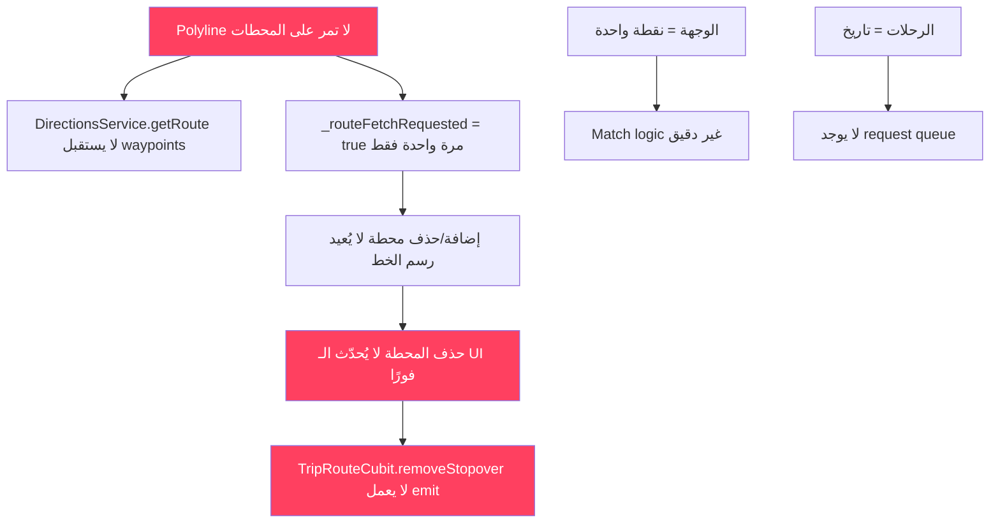

# 🔬 تحليل هندسي عميق — نظام الخريطة والرحلات

---

## ١. مشكلة الـ Polyline

### 🔴 التشخيص عند السائق

**الملف:** [trip_details_screen.dart](file:///Volumes/alaaMac/driverr/taxi_app/lib/features/driver/presentation/trip_details/trip_details_screen.dart#L620-L647)

**السبب الجذري:** `_fetchRoute()` تُستدعى بنقطتين فقط (pickup → destination) وتتجاهل المحطات الوسيطة تمامًا:

```dart
// L620-624 — المشكلة: لا يمرر waypoints!
if (pLat != null && pLng != null && dLat != null && dLng != null && !_routeFetchRequested) {
  _routeFetchRequested = true;
  WidgetsBinding.instance.addPostFrameCallback((_) =>
      _fetchRoute(pLat, pLng, dLat, dLng)); // ❌ بدون stopovers
}
```

بينما `DirectionsService.getRoute()` يدعم `waypoints` parameter فعلاً (L42-58 في directions_service.dart)، لكن لا أحد يمرره!

**الحل:**

```dart
// في _buildMap — بعد جمع stopovers
if (pLat != null && pLng != null && dLat != null && dLng != null && !_routeFetchRequested) {
  _routeFetchRequested = true;
  final wpLatLngs = stopovers.map((w) => LatLng(w.lat, w.lng)).toList();
  WidgetsBinding.instance.addPostFrameCallback((_) =>
      _fetchRouteWithWaypoints(pLat, pLng, dLat, dLng, wpLatLngs));
}

Future<void> _fetchRouteWithWaypoints(double oLat, double oLng, 
    double dLat, double dLng, List<LatLng> waypoints) async {
  final result = await DirectionsService.getRoute(
    originLat: oLat, originLng: oLng,
    destLat: dLat, destLng: dLng,
    waypoints: waypoints,
    apiKey: EnvConstants.googleMapsApiKey,
  );
  if (!mounted || result == null) return;
  setState(() => _routePoints = result.points);
}
```

**مشكلة إضافية:** `_routeFetchRequested = true` يُنفذ مرة واحدة فقط. عند إضافة/حذف محطة، لن يُعاد رسم الخط. الحل: إعادة `_routeFetchRequested = false` عند تغيّر عدد المحطات.

### 🔴 التشخيص عند المستخدم — Tracking Screen

**الملف:** [tracking_bloc.dart](file:///Volumes/alaaMac/driverr/taxi_app/lib/features/user/presentation/tracking/bloc/tracking_bloc.dart#L82-L112)

**المشكلة:** الـ Bloc يحسب الـ route مرة واحدة عند التحميل ولا يُحدّثه عند تغيّر الحالة:

| الحالة            | المتوقع                                      | الفعلي                          |
| ----------------------- | --------------------------------------------------- | ------------------------------------- |
| `accepted`            | خط من السائق → نقطة الالتقاء | ✅ يعمل (L89-98)                  |
| `in_progress`         | خط من pickup → waypoints → destination        | ❌ لا يمرر waypoints            |
| تغيّر الحالة | إعادة حساب الخط                        | ❌ لا يحدث — الخط ثابت |

**State Transitions المطلوبة:**

```
searching → accepted:    polyline = driver_location → pickup
accepted → in_progress:  polyline = pickup → [waypoints] → destination  
driver moves:            re-fit camera bounds (لا إعادة حساب route)
```

**الحل في TrackingBloc:**

```dart
// عند تغيّر status في _subscribeToTripUpdates:
if (row['status'] == 'in_progress' && current.trip['status'] == 'accepted') {
  // أعد حساب الـ route من pickup عبر waypoints إلى destination
  add(RecalculateRoute(tripId));
}
```

### 🔴 مشكلة `overview_polyline` في DirectionsService

**الملف:** [directions_service.dart](file:///Volumes/alaaMac/driverr/taxi_app/lib/services/directions_service.dart#L72-L76)

عند وجود waypoints، Google Directions API يُرجع عدة `legs`. الكود الحالي يقرأ `leg[0]` فقط:

```dart
final leg = (route['legs'] as List).first; // ❌ يأخذ أول leg فقط
```

الـ `overview_polyline` يشمل المسار كاملاً (صحيح)، لكن المسافة والمدة يجب أن تُجمع من كل الـ legs:

```dart
final legs = route['legs'] as List;
int totalDistance = 0, totalDuration = 0;
for (final leg in legs) {
  totalDistance += (leg as Map)['distance']['value'] as int;
  totalDuration += (leg as Map)['duration']['value'] as int;
}
```

---

## ٢. إضافة محطة — Map-Based Selection

### 🔴 التشخيص

**الملف:** [UserAddStopoverDialog](file:///Volumes/alaaMac/driverr/taxi_app/lib/features/user/presentation/trip_details/trip_details_screen.dart#L1772-L1864)

الحالي: `AlertDialog` + `TextField` + `locationFromAddress()` — غير دقيق ويعتمد على geocoding نصي.

### ✅ الحل: Full-Screen Map Picker

```dart
class MapStopoverPicker extends StatefulWidget {
  final LatLng initialCenter; // مركز الخريطة الحالي
  const MapStopoverPicker({super.key, required this.initialCenter});
  
  @override
  State<MapStopoverPicker> createState() => _MapStopoverPickerState();
}

class _MapStopoverPickerState extends State<MapStopoverPicker> {
  LatLng? _selectedPoint;
  String? _resolvedAddress;
  
  @override
  Widget build(BuildContext context) {
    return Scaffold(
      body: Stack(children: [
        GoogleMap(
          initialCameraPosition: CameraPosition(
            target: widget.initialCenter, zoom: 15),
          onTap: (latLng) async {
            setState(() => _selectedPoint = latLng);
            // Reverse geocode
            final placemarks = await placemarkFromCoordinates(
              latLng.latitude, latLng.longitude);
            if (placemarks.isNotEmpty) {
              setState(() => _resolvedAddress = 
                '${placemarks.first.street}, ${placemarks.first.locality}');
            }
          },
          markers: _selectedPoint != null ? {
            Marker(markerId: const MarkerId('selected'),
              position: _selectedPoint!)
          } : {},
        ),
        // Pin icon ثابت في المنتصف + زر تأكيد
        // ...
      ]),
    );
  }
}
```

**التكامل:**

```dart
void _showAddStopoverDialog(BuildContext context) {
  Navigator.push(context, MaterialPageRoute(
    builder: (_) => MapStopoverPicker(
      initialCenter: LatLng(pLat, pLng),
    ),
  )).then((result) {
    if (result != null) {
      _routeCubit.addStopover(
        lat: result.lat, lng: result.lng,
        address: result.address,
      );
    }
  });
}
```

---

## ٣. حذف المحطة — عدم التحديث الفوري

### 🔴 التشخيص

**الملف:** [trip_route_cubit.dart](file:///Volumes/alaaMac/driverr/taxi_app/lib/features/trips/presentation/bloc/trip_route_cubit.dart#L103-L106)

```dart
Future<void> removeStopover(String waypointId) async {
  await _routeRepository.removeStopover(waypointId); // ← فقط RPC، بدون emit!
}
```

**السبب:** الحذف يعتمد فقط على Supabase Realtime stream لتحديث الـ UI. إذا كان الـ stream بطيئًا أو متأخرًا، الـ UI لا يتحدث.

**مشكلة أخرى في UserTripDetailsScreen:** الـ `_routeCubit` يُنشأ محليًا داخل `initState` (L88):

```dart
_routeCubit = TripRouteCubit()..watchTripRoutes(widget.tripId);
```

لكن في `_showAddStopoverDialog` يُمرر عبر `BlocProvider.value`. إذا كان الـ dialog يستخدم `context.read<TripRouteCubit>()` والشاشة الأصلية تستخدم `_routeCubit` المحلي، فهما نفس الـ instance ✅.

### ✅ الحل: Optimistic UI Update

```dart
Future<void> removeStopover(String waypointId) async {
  // ١. حذف فوري من الـ state (optimistic)
  final updatedWaypoints = state.waypoints
      .where((w) => w.id != waypointId)
      .toList();
  emit(state.copyWith(waypoints: updatedWaypoints));
  
  // ٢. حذف من الـ DB
  final success = await _routeRepository.removeStopover(waypointId);
  
  // ٣. لو فشل، أرجع الـ state القديم
  if (!success) {
    emit(state.copyWith(
      waypoints: state.waypoints, // restore
      errorMessage: 'فشل حذف المحطة',
    ));
  }
}
```

**نفس المبدأ لـ addStopover:**

```dart
Future<void> addStopover({...}) async {
  // Optimistic: أضف placeholder
  final tempWaypoint = TripRouteWaypointModel(
    id: 'temp_${DateTime.now().millisecondsSinceEpoch}',
    routePlanId: activePlan!.id,
    seqOrder: state.waypoints.length,
    role: RouteWaypointRole.stopover,
    lat: lat, lng: lng,
    address: address,
  );
  emit(state.copyWith(
    waypoints: [...state.waypoints, tempWaypoint],
  ));
  
  // ثم أرسل للـ DB — الـ realtime stream سيستبدل الـ temp
  await _routeRepository.addStopover(...);
}
```

---

## ٤. زر "غير متاح" — مشكلة بصرية

### 🔴 التشخيص

**الملف:** [driver_home_screen.dart](file:///Volumes/alaaMac/driverr/taxi_app/lib/features/driver/presentation/home/driver_home_screen.dart#L417-L445)

الـ Bottom Nav الحالي يحتوي على **عنصرين فقط** ("الرحلات" و "الوجهة") + زر GO دائري في المنتصف. **لا يوجد زر "غير متاح" كعنصر ثالث**.

زر GO هو فعلياً toggle للحالة (online/offline). عندما يكون offline، يعمل كزر "غير متاح".

### ✅ الحل المقترح

الزر الدائري الأوسط (GO) هو نفسه "غير متاح" — يجب تحسينه بصريًا:

```dart
// في _NotchPainter — تعديل القيم:
CustomAnimatedBottomNav(
  notchRadius: 38,        // كان 42 — أصغر قليلاً
  gapWidth: 80,           // كان 90 — أضيق
  height: 72,             // زيادة بسيطة للمساحة السفلية
)
```

**تحسين الـ FAB container:**

```dart
Widget _buildFab() {
  return Container(
    width: notchRadius * 2 - 8,
    height: notchRadius * 2 - 8,
    margin: const EdgeInsets.only(bottom: 4), // مساحة إضافية
    // ...
  );
}
```

**تحسين الـ bottom padding:**

```dart
// في _NotchPainter.paint — إضافة حافة سفلية مدورة:
path.lineTo(size.width, size.height - 8);
path.quadraticBezierTo(size.width, size.height, size.width - 8, size.height);
path.lineTo(8, size.height);
path.quadraticBezierTo(0, size.height, 0, size.height - 8);
```

---

## ٥. زر "الوجهة" — إعادة تعريف المفهوم

### 🔴 التشخيص

**الملف:** [_TargetRouteDialog](file:///Volumes/alaaMac/driverr/taxi_app/lib/features/driver/presentation/home/driver_home_screen.dart#L587-L713)

الحالي: يحفظ نقطة واحدة (lat, lng, address) عبر `set_driver_target_route`.

### ✅ إعادة التعريف

**"الوجهة" = Route Corridor** — ليست نقطة واحدة بل **ممر جغرافي** من منطقة A إلى منطقة B:

| المفهوم             | التعريف                                                                                            |
| -------------------------- | --------------------------------------------------------------------------------------------------------- |
| **Origin Zone**      | دائرة بنصف قطر ~2 كم حول موقع السائق الحالي                              |
| **Destination Zone** | دائرة بنصف قطر ~3 كم حول الوجهة المطلوبة                                   |
| **Corridor**         | الممر الجغرافي بين المنطقتين                                                     |
| **Match Logic**      | طلب المستخدم يُقبل إذا: pickup ∈ Origin Zone AND destination ∈ Corridor ∪ Dest Zone |

### ✅ التنفيذ المطلوب

**١. Schema Update:**

```sql
ALTER TABLE driver_target_routes ADD COLUMN
  origin_lat DOUBLE PRECISION,
  origin_lng DOUBLE PRECISION,
  origin_radius_km DOUBLE PRECISION DEFAULT 2.0,
  dest_radius_km DOUBLE PRECISION DEFAULT 3.0;
```

**٢. UI محسّن — خريطة بدل TextField:**

```dart
class TargetRouteMapPicker extends StatefulWidget { ... }
// خريطة full-screen مع:
// - دائرة خضراء حول الموقع الحالي (origin zone)  
// - marker قابل للسحب للوجهة
// - دائرة زرقاء حول الوجهة (dest zone)
// - خط بينهما يمثل الـ corridor
// - slider لضبط نصف القطر
```

**٣. Match Logic في الـ Backend:**

```sql
CREATE FUNCTION matches_driver_corridor(
  p_driver_id UUID,
  p_pickup_lat FLOAT, p_pickup_lng FLOAT,
  p_dest_lat FLOAT, p_dest_lng FLOAT
) RETURNS BOOLEAN AS $$
  -- ST_DWithin for origin zone check
  -- ST_DWithin for destination zone check
  -- Combined corridor match
$$;
```

---

## ٦. زر "الرحلات" — Request Queue

### 🔴 التشخيص

**الملف:** [driver_home_screen.dart L432-433](file:///Volumes/alaaMac/driverr/taxi_app/lib/features/driver/presentation/home/driver_home_screen.dart#L432-L433)

```dart
if (index == 0) {
  context.push(AppRoutes.driverTrips); // ← يذهب لصفحة رحلات السائق السابقة
}
```

هذا يفتح صفحة **تاريخ الرحلات** وليس **قائمة الطلبات المتاحة**.

### ✅ المطلوب: Request Feed (Queue)

**Lifecycle للطلب:**

```
pending → [sent_to_driver] → accepted | rejected | expired | cancelled
```

**UI المقترح:**

```dart
class DriverRequestFeedScreen extends StatefulWidget { ... }

// كل طلب = Card يحتوي:
// - اسم المستخدم + تقييمه
// - نقطة الالتقاء → الوجهة
// - المسافة والسعر المتوقع
// - زر قبول (أخضر) + زر رفض (أحمر)
// - Timer يعد تنازليًا (30 ثانية مثلاً)
```

**Realtime Subscription:**

```dart
class RequestFeedBloc extends Bloc<RequestFeedEvent, RequestFeedState> {
  void _subscribeToRequests() {
    _sub = SupabaseService.client
        .from('trip_offers')
        .stream(primaryKey: ['id'])
        .eq('driver_id', currentDriverId)
        .eq('status', 'pending')
        .listen((rows) {
      // تحديث فوري — الكرت يختفي عند:
      // - قبول سائق آخر (status != pending)
      // - إلغاء المستخدم
      // - انتهاء المهلة
      add(RequestsUpdated(rows));
    });
  }
}
```

**اختفاء فوري للكروت:**

```dart
BlocBuilder<RequestFeedBloc, RequestFeedState>(
  builder: (context, state) {
    return AnimatedList(
      // استخدام AnimatedList بدل ListView
      // عند حذف عنصر: slideOut animation
    );
  },
)
```

---

## ٧. خريطة 3D

### ✅ التنفيذ

**Google Maps Flutter يدعم 3D عبر CameraPosition:**

```dart
// زر Toggle في أعلى الخريطة:
bool _is3DMode = false;

Widget _build3DToggle() {
  return _MapCircleBtn(
    icon: _is3DMode ? Icons.view_in_ar : Icons.map_outlined,
    onTap: () async {
      setState(() => _is3DMode = !_is3DMode);
      if (_mapController != null) {
        final currentPos = _driverLocation ?? defaultCenter;
        await _mapController!.animateCamera(
          CameraUpdate.newCameraPosition(
            CameraPosition(
              target: currentPos,
              zoom: _is3DMode ? 18 : 15,
              tilt: _is3DMode ? 60 : 0,    // ← المفتاح
              bearing: _driverHeading,
            ),
          ),
        );
      }
    },
  );
}
```

**تتبع 3D أثناء القيادة:**

```dart
// في _startLocationTracking عند السائق:
if (_cameraFollowing && _is3DMode) {
  ctrl.animateCamera(CameraUpdate.newCameraPosition(
    CameraPosition(
      target: _driverLocation!,
      zoom: 18,
      tilt: 60,
      bearing: _driverHeading, // الكاميرا تدور مع اتجاه السيارة
    ),
  ));
}
```

---

## ٨. خطة التنفيذ المرتبة بالأولوية

| # | المهمة                                       | الأولوية | التعقيد | الملفات                                                     |
| - | -------------------------------------------------- | ---------------- | -------------- | ------------------------------------------------------------------ |
| 1 | إصلاح Polyline مع waypoints                 | 🔴 حرج        | متوسط     | `trip_details_screen.dart` (driver), `directions_service.dart` |
| 2 | Optimistic delete للمحطات                   | 🔴 حرج        | منخفض     | `trip_route_cubit.dart`                                          |
| 3 | Polyline transitions عند المستخدم       | 🔴 حرج        | عالي       | `tracking_bloc.dart`, `tracking_screen.dart`                   |
| 4 | Map picker لإضافة محطة                   | 🟡 مهم        | متوسط     | `trip_details_screen.dart` (user) — widget جديد             |
| 5 | Request Feed للسائق                          | 🟡 مهم        | عالي       | شاشة جديدة + bloc جديد                                |
| 6 | إعادة تعريف "الوجهة" كـ corridor | 🟡 مهم        | عالي       | `driver_home_screen.dart` + schema                               |
| 7 | تحسين Bottom Nav بصريًا                 | 🟢 تجميلي  | منخفض     | `custom_animated_bottom_nav.dart`                                |
| 8 | 3D Map toggle                                      | 🟢 تجميلي  | منخفض     | كلا الشاشتين                                            |

---

## ترابط المشكلات



> [!IMPORTANT]
> المشاكل 1، 2، 3 مترابطة وتشترك في سبب جذري واحد: **الـ polyline تُحسب مرة واحدة بدون waypoints ولا تُعاد حسابها عند تغيّر البيانات**.
>
