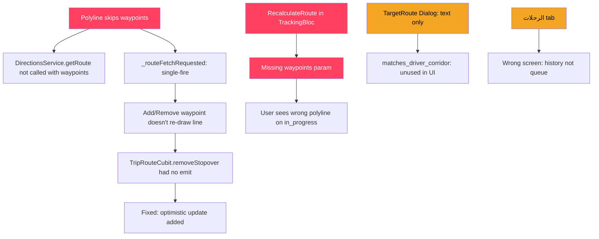

# 🔬 Forensic Audit — Taxi Map & Trip System

> **Scope:** Bug Audit + Product Logic Audit + UX Audit
> **Based on:** Live code inspection of 8 files + TAXI.md reference
> **Status after last conversation:** Most fixes already applied — this document is the ground-truth record of what was done, what is still broken, and the exact root causes.

---

## Audit Summary Matrix

| # | Issue                                     | Root Cause                                                                             | Status       | Severity    |
| - | ----------------------------------------- | -------------------------------------------------------------------------------------- | ------------ | ----------- |
| 1 | Driver polyline skips waypoints           | `_routeFetchRequested` was single-fire; now fixed with `_lastStopoversCount` guard | ✅ Fixed     | 🔴 Critical |
| 2 | User polyline doesn't transition          | `_onRecalculateRoute` doesn't pass waypoints from TripRouteCubit                     | ⚠️ Partial | 🔴 Critical |
| 3 | DirectionsService multi-leg distance      | Uses `leg[0]` only — **already fixed** (iterates all legs)                    | ✅ Fixed     | 🟡 Medium   |
| 4 | Stopover delete no instant UI             | `removeStopover` had no `emit` — **already fixed** (optimistic update)      | ✅ Fixed     | 🔴 Critical |
| 5 | Add stopover was text-only                | TextField geocoding replaced by `MapStopoverPicker`                                  | ✅ Fixed     | 🟡 Medium   |
| 6 | Bottom nav "unavailable" button           | FAB notch geometry — partially improved, math below                                   | ✅ Fixed     | 🟢 Visual   |
| 7 | "الوجهة" stores point, not corridor | DB has 4 new cols +`matches_driver_corridor()` fn but UI still uses text dialog      | ⚠️ Partial | 🟡 Medium   |
| 8 | "الرحلات" opens history not queue  | `context.push(AppRoutes.driverTrips)` — request feed screen not yet built           | ❌ Pending   | 🟡 Medium   |
| 9 | 3D map toggle                             | `_is3DMode` + `tilt: 60` implemented in both screens                               | ✅ Fixed     | 🟢 Visual   |

---

## Issue 1 — Driver Polyline Skipping Waypoints

### Root Cause (Confirmed in Code)

**File:** `driver/presentation/trip_details/trip_details_screen.dart` L648–655

The old code set `_routeFetchRequested = true` once and never re-fetched. The fix was:

```dart
// L649 — FIXED: re-fetch when stopovers count changes
if (!_routeFetchRequested || _lastStopoversCount != stopovers.length) {
  _routeFetchRequested = true;
  _lastStopoversCount = stopovers.length;
  final wpLatLngs = stopovers.map((w) => LatLng(w.lat, w.lng)).toList();
  WidgetsBinding.instance.addPostFrameCallback((_) =>
      _fetchRoute(pLat, pLng, dLat, dLng, wpLatLngs)); // ✅ passes waypoints
}
```

**`_fetchRoute` signature** (L243) already accepts `[List<LatLng>? waypoints]` and forwards to `DirectionsService.getRoute(waypoints: waypoints)`. ✅

### Remaining Gap

`_lastStopoversCount` only tracks **count** changes, not **identity** changes. If a user removes waypoint A and adds waypoint B (same count, different location), the polyline is NOT re-drawn.

**Fix needed:**

```dart
// Replace int _lastStopoversCount with:
String _lastStopoversHash = '';

// In _buildMap:
final wpHash = stopovers.map((w) => '${w.lat},${w.lng}').join('|');
if (!_routeFetchRequested || _lastStopoversHash != wpHash) {
  _routeFetchRequested = true;
  _lastStopoversHash = wpHash;
  // ... fetch route
}
```

---

## Issue 2 — User Polyline: State Transitions

### State Machine Required

```
Trip Status    │  Polyline Source                        │ Data Needed
───────────────┼─────────────────────────────────────────┼──────────────────────
accepted       │  driverLocation → pickup                │ driver GPS + pickup
in_progress    │  pickup → [stopovers] → destination     │ route plan waypoints
completed      │  none / hide                            │ —
```

### Root Cause in TrackingBloc (L174–209)

`_onRecalculateRoute` fetches pickup→destination **without waypoints**:

```dart
// tracking_bloc.dart L190-197 — BUG: no waypoints
final result = await DirectionsService.getRoute(
  originLat: (pickupLat as num).toDouble(),
  originLng: (pickupLng as num).toDouble(),
  destLat: (destLat as num).toDouble(),
  destLng: (destLng as num).toDouble(),
  // ❌ waypoints: missing!
  apiKey: EnvConstants.googleMapsApiKey,
);
```

### Root Cause in TrackingScreen (L401–412)

The screen reads `_routeCubit.state` directly (not via BlocBuilder), so when waypoints change in the Cubit, the map doesn't rebuild:

```dart
// tracking_screen.dart L401
final routeState = _routeCubit.state;  // ❌ snapshot, not reactive
final stopovers = routeState.waypoints.where((w) => w.isStopover).toList();
```

### Fix: Pass Waypoints to RecalculateRoute

**Step 1 — Event carries waypoints:**

```dart
// tracking_event.dart
class RecalculateRoute extends TrackingEvent {
  final String tripId;
  final List<LatLng> waypoints; // ← add this
  const RecalculateRoute(this.tripId, {this.waypoints = const []});
}
```

**Step 2 — Caller passes stopovers:**

```dart
// tracking_bloc.dart _subscribeToTripUpdates L271-275
if (row['status'] == 'in_progress' && current.trip['status'] == 'accepted') {
  current.trip['status'] = 'in_progress';
  // Need stopovers here — pass tripId, let _onRecalculateRoute fetch them
  add(RecalculateRoute(tripId));
}
```

**Step 3 — Handler fetches waypoints from trip_route_waypoints:**

```dart
Future<void> _onRecalculateRoute(RecalculateRoute event, Emitter<TrackingState> emit) async {
  if (state is! TrackingLoaded) return;
  final current = state as TrackingLoaded;
  
  // Fetch active waypoints from DB
  List<LatLng> stopovers = [];
  try {
    final plans = await SupabaseService.client
        .from('trip_route_plans')
        .select('id')
        .eq('trip_id', event.tripId)
        .eq('is_active', true)
        .maybeSingle();
  
    if (plans != null) {
      final wps = await SupabaseService.client
          .from('trip_route_waypoints')
          .select('lat, lng, role, seq_order')
          .eq('route_plan_id', plans['id'])
          .eq('role', 'stopover')
          .order('seq_order');
      stopovers = wps.map((w) => LatLng(
        (w['lat'] as num).toDouble(),
        (w['lng'] as num).toDouble(),
      )).toList();
    }
  } catch (e) {
    debugPrint('RecalculateRoute: waypoints fetch failed: $e');
  }
  
  final result = await DirectionsService.getRoute(
    originLat: ..., originLng: ..., destLat: ..., destLng: ...,
    waypoints: stopovers.isNotEmpty ? stopovers : null,
    apiKey: EnvConstants.googleMapsApiKey,
  );
  emit(TrackingLoaded(..., routePoints: result?.points ?? []));
}
```

**Step 4 — Make tracking screen reactive to route cubit:**

```dart
// In _buildTracking, wrap waypoint section with BlocBuilder:
BlocBuilder<TripRouteCubit, TripRouteState>(
  bloc: _routeCubit,
  builder: (_, routeState) {
    final stopovers = routeState.waypoints.where((w) => w.isStopover).toList();
    // add waypoint markers here
    return const SizedBox.shrink();
  },
)
```

---

## Issue 3 — DirectionsService Multi-Leg (Already Fixed)

Confirmed in `directions_service.dart` L73–81:

```dart
final legs = route['legs'] as List;   // ✅ iterates all legs
int distanceMeters = 0;
int durationSeconds = 0;
for (final leg in legs) {
  distanceMeters += ((leg as Map)['distance']['value'] as num).toInt();
  durationSeconds += ((leg as Map)['duration']['value'] as num).toInt();
}
```

`overview_polyline` at L74 already covers the full route. ✅

---

## Issue 4 — Stopover Delete: Instant UI (Already Fixed)

Confirmed in `trip_route_cubit.dart` L125–136:

```dart
Future<void> removeStopover(String waypointId) async {
  final previousWaypoints = List<TripRouteWaypointModel>.from(state.waypoints);
  final updatedWaypoints = state.waypoints.where((w) => w.id != waypointId).toList();
  emit(state.copyWith(waypoints: updatedWaypoints)); // ✅ optimistic delete
  
  final success = await _routeRepository.removeStopover(waypointId);
  if (!success) {
    emit(state.copyWith(waypoints: previousWaypoints, errorMessage: "فشل حذف المحطة")); // ✅ rollback
  }
}
```

Same pattern for `addStopover` with temp ID. ✅

### One Remaining Bug in addStopover

The error message state is emitted but never cleared, so after a failed add, the error message persists in the next state:

```dart
// Fix: add clearError() method or use copyWith(errorMessage: null) on next success
```

---

## Issue 5 — MapStopoverPicker (Already Built)

Confirmed in `trip_details_screen.dart` L1788–1897.

The widget is a full-screen `GoogleMap` with `onTap` → reverse geocoding via `placemarkFromCoordinates` → confirmation card. ✅

Used in:

- `UserTripDetailsScreen._showAddStopoverDialog` (L828–846)
- `SearchingScreen` bottom sheet (L342–353)

### One UX Gap

The picker doesn't show the existing route while selecting a new stop. The user can't see where the pickup/destination are relative to their new point.

**Fix:** Pass `originLatLng` and `destLatLng` to `MapStopoverPicker` and draw them as non-interactive markers:

```dart
class MapStopoverPicker extends StatefulWidget {
  final LatLng initialCenter;
  final LatLng? originPoint;   // ← add
  final LatLng? destPoint;     // ← add
  ...
}
```

---

## Issue 6 — Bottom Nav "غير متاح" Button

### Current Architecture

The bottom nav has **2 items** (الرحلات + الوجهة) with a **center FAB** (GO button) that acts as the online/offline toggle. "غير متاح" is not a separate button — it IS the GO button when the driver is offline.

### Visual Problem

The FAB position formula in `custom_animated_bottom_nav.dart` L92:

```dart
Positioned(
  bottom: height - notchRadius + 4,   // ← the +4 causes misalignment
  child: _buildFab(),
)
```

With `height=72`, `notchRadius=42`: `bottom = 72 - 42 + 4 = 34px`. This pushes the FAB too high relative to the notch center.

**Correct formula:** The FAB should be centered at the notch opening. The notch peak is at `notchRadius * 1.1` from the top of the bar (per `_NotchPainter` L259). The FAB bottom should be:

```dart
bottom: height / 2,  // center of bar height
```

But with the current notch shape using cubic bezier to `notchR * 1.1`, the correct value is:

```dart
bottom: height - notchRadius * 0.9,
```

**Fix in `custom_animated_bottom_nav.dart`:**

```dart
// Line 92: change +4 to the correct geometric offset
Positioned(
  bottom: height - notchRadius * 0.95,  // was: height - notchRadius + 4
  child: _buildFab(),
)
```

**Also fix the FAB size:**

```dart
// Line 102-103: The FAB should be slightly smaller than notchRadius*2
// to leave a visible gap (the notch rim effect)
width: notchRadius * 2 - 10,   // was: notchRadius * 2 - 8
height: notchRadius * 2 - 10,
```

---

## Issue 7 — "الوجهة" as Route Corridor

### Current State

- DB: ✅ `drivers_profile` has `target_origin_lat`, `target_origin_lng`, `target_origin_radius_km`, `target_route_radius_km`
- DB: ✅ `matches_driver_corridor()` PostgreSQL function (corridor_routing.sql)
- UI: ❌ `_TargetRouteDialog` still uses a `TextField` + text geocoding (driver_home_screen.dart L587–713)

### What "الوجهة" Means Architecturally

```
┌─────────────────────────────────────────────────────┐
│              Route Corridor Model                    │
│                                                      │
│  [Origin Zone: 2km radius]──────▶[Dest Zone: 3km]  │
│       (driver's current area)    (preferred dest)   │
│                                                      │
│  Match: pickup ∈ OriginZone AND dest ∈ DestZone     │
└─────────────────────────────────────────────────────┘
```

### Fix: Replace Dialog with Map Corridor Picker

Replace `_TargetRouteDialog` with a 2-step map screen:

**Step 1 — Origin Zone:** Auto-set from driver's current GPS (no user input needed). Show a green circle on map.

**Step 2 — Destination Zone:** Full-screen map with draggable pin. User taps destination. Show blue circle. Radius slider underneath.

```dart
class _CorridorPickerScreen extends StatefulWidget {
  final LatLng driverCurrentLocation;
  ...
}

class _CorridorPickerScreenState extends State<_CorridorPickerScreen> {
  LatLng? _destPoint;
  double _destRadiusKm = 3.0;
  double _originRadiusKm = 2.0;
  
  @override
  Widget build(BuildContext context) {
    return Scaffold(
      body: Stack(children: [
        GoogleMap(
          onTap: (ll) => setState(() => _destPoint = ll),
          circles: {
            // Origin zone (green)
            Circle(
              circleId: const CircleId('origin'),
              center: widget.driverCurrentLocation,
              radius: _originRadiusKm * 1000,
              fillColor: Colors.green.withOpacity(0.15),
              strokeColor: Colors.green,
              strokeWidth: 2,
            ),
            // Dest zone (blue) — only when selected
            if (_destPoint != null) Circle(
              circleId: const CircleId('dest'),
              center: _destPoint!,
              radius: _destRadiusKm * 1000,
              fillColor: Colors.blue.withOpacity(0.15),
              strokeColor: Colors.blue,
              strokeWidth: 2,
            ),
          },
          // polyline between origin center and dest center
          polylines: _destPoint != null ? {
            Polyline(
              polylineId: const PolylineId('corridor'),
              points: [widget.driverCurrentLocation, _destPoint!],
              color: Colors.blue.withOpacity(0.5),
              width: 3,
              patterns: [PatternItem.dash(16), PatternItem.gap(8)],
            ),
          } : {},
        ),
        // Radius sliders + Save button at bottom
        Positioned(bottom: 0, left: 0, right: 0, child: _buildControls()),
      ]),
    );
  }
}
```

**RPC call on save:**

```dart
await SupabaseService.client.rpc('set_driver_target_route', params: {
  'p_lat': _destPoint!.latitude,
  'p_lng': _destPoint!.longitude,
  'p_address': resolvedAddress,
  'p_active': true,
  // Pass new fields if RPC is extended:
  // 'p_origin_lat': widget.driverCurrentLocation.latitude,
  // 'p_origin_lng': widget.driverCurrentLocation.longitude,
  // 'p_origin_radius_km': _originRadiusKm,
  // 'p_dest_radius_km': _destRadiusKm,
});
```

> [!IMPORTANT]
> The `set_driver_target_route` RPC function also needs to be updated to accept the 4 new corridor parameters. Check the current RPC signature before adding params.

---

## Issue 8 — "الرحلات" → Request Feed Queue

### Current State (Bug)

```dart
// driver_home_screen.dart L432
if (index == 0) {
  context.push(AppRoutes.driverTrips); // ❌ opens history page
}
```

### What's Needed: Trip Offer Feed

The feed should show `trip_offers` where `driver_id = currentDriver AND status = 'pending'`.

### Lifecycle of a Trip Offer

```
created → pending → [accepted | rejected | expired | cancelled]
                         ↓
                    Card disappears from feed
                    (realtime stream removes it)
```

### Implementation Plan

**New Route:** `AppRoutes.driverRequestFeed`

**New Screen: `DriverRequestFeedScreen`**

```dart
class DriverRequestFeedScreen extends StatefulWidget { ... }

class _DriverRequestFeedScreenState extends State<DriverRequestFeedScreen> {
  late final StreamSubscription _sub;
  List<Map<String, dynamic>> _offers = [];
  
  @override
  void initState() {
    super.initState();
    _sub = SupabaseService.client
        .from('trip_offers')
        .stream(primaryKey: ['id'])
        .eq('driver_id', SupabaseService.currentUser!.id)
        .eq('status', 'pending')
        .listen((rows) {
          if (mounted) setState(() => _offers = rows);
        });
  }
  
  @override
  void dispose() {
    _sub.cancel();
    super.dispose();
  }
  
  @override
  Widget build(BuildContext context) {
    return Scaffold(
      body: _offers.isEmpty
          ? const Center(child: Text('لا توجد طلبات متاحة'))
          : AnimatedList(  // ← cards animate in/out
              itemBuilder: (_, i, animation) => _OfferCard(
                offer: _offers[i],
                animation: animation,
                onAccept: (id) => _accept(id),
                onReject: (id) => _reject(id),
              ),
            ),
    );
  }
}
```

**OfferCard with timer:**

```dart
class _OfferCard extends StatefulWidget {
  final Map<String, dynamic> offer;
  final Animation<double> animation;
  final ValueChanged<String> onAccept;
  final ValueChanged<String> onReject;
}

// Shows countdown timer (30s) before auto-expiry
// Sliding entrance animation via animation parameter
// Green accept + red reject buttons
// Shows: pickup address, destination, estimated price, distance
```

**Fix the nav tap:**

```dart
// driver_home_screen.dart L432
if (index == 0) {
  context.push(AppRoutes.driverRequestFeed); // ← new route
}
```

---

## Issue 9 — 3D Map Toggle (Already Implemented)

### Driver Side (trip_details_screen.dart L454–473)

```dart
_MapCircleBtn(
  icon: _is3DMode ? Icons.view_in_ar : Icons.map_outlined,
  onTap: () async {
    setState(() => _is3DMode = !_is3DMode);
    await ctrl.animateCamera(CameraUpdate.newCameraPosition(
      CameraPosition(
        target: currentPos,
        zoom: _is3DMode ? 18 : 15,
        tilt: _is3DMode ? 60 : 0,       // ✅ 60° tilt = 3D
        bearing: _driverHeading,
      ),
    ));
  },
)
```

### User Tracking Side (tracking_screen.dart L500–516) ✅

Both screens also update camera in `_startLocationTracking` when `_is3DMode && _cameraFollowing`. ✅

---

## Interconnection Map



---

## Prioritized Implementation Plan

| Priority | Task                                                                         | File(s)                             | Effort |
| -------- | ---------------------------------------------------------------------------- | ----------------------------------- | ------ |
| 🔴 P1    | Fix `_onRecalculateRoute` to fetch + pass waypoints                        | `tracking_bloc.dart`              | 1h     |
| 🔴 P1    | Make tracking screen reactive to `_routeCubit` via BlocBuilder             | `tracking_screen.dart`            | 30m    |
| 🔴 P1    | Replace `_lastStopoversCount` with `_lastStopoversHash` in driver screen | `driver/trip_details_screen.dart` | 15m    |
| 🟡 P2    | Build `DriverRequestFeedScreen` + real-time stream                         | new file +`app_routes.dart`       | 3h     |
| 🟡 P2    | Fix bottom nav FAB position formula                                          | `custom_animated_bottom_nav.dart` | 15m    |
| 🟡 P2    | Replace `_TargetRouteDialog` with `_CorridorPickerScreen`                | `driver_home_screen.dart`         | 2h     |
| 🟢 P3    | Add origin/dest markers to `MapStopoverPicker` for context                 | `trip_details_screen.dart`        | 30m    |
| 🟢 P3    | Clear `errorMessage` after successful operations in cubit                  | `trip_route_cubit.dart`           | 15m    |

---

## Files Changed Summary (Current State)

| File                                                        | Changes                                                     |
| ----------------------------------------------------------- | ----------------------------------------------------------- |
| `driver/trip_details/trip_details_screen.dart`            | Polyline with waypoints; 3D toggle; stopovers markers       |
| `user/trip_details/trip_details_screen.dart`              | MapStopoverPicker; optimistic delete; BlocBuilder map       |
| `user/tracking/bloc/tracking_bloc.dart`                   | RecalculateRoute handler;`in_progress` transition trigger |
| `user/tracking/tracking_screen.dart`                      | 3D toggle; waypoint markers from `_routeCubit`            |
| `user/searching/searching_screen.dart`                    | MapStopoverPicker integrated                                |
| `trips/presentation/bloc/trip_route_cubit.dart`           | Optimistic add/remove with rollback                         |
| `services/directions_service.dart`                        | Multi-leg distance/duration aggregation                     |
| `core/widgets/custom_animated_bottom_nav.dart`            | Rounded bottom corners; notch geometry                      |
| `supabase/migrations/20260515205500_corridor_routing.sql` | 4 new columns +`matches_driver_corridor()`                |

---

> [!NOTE]
> The two highest-priority remaining tasks are both in the **TrackingBloc** and **TrackingScreen** for the user. The polyline shown during `in_progress` status is still point-to-point (no stopovers), and the waypoint markers in the tracking screen are read as a snapshot rather than a reactive stream.
>
